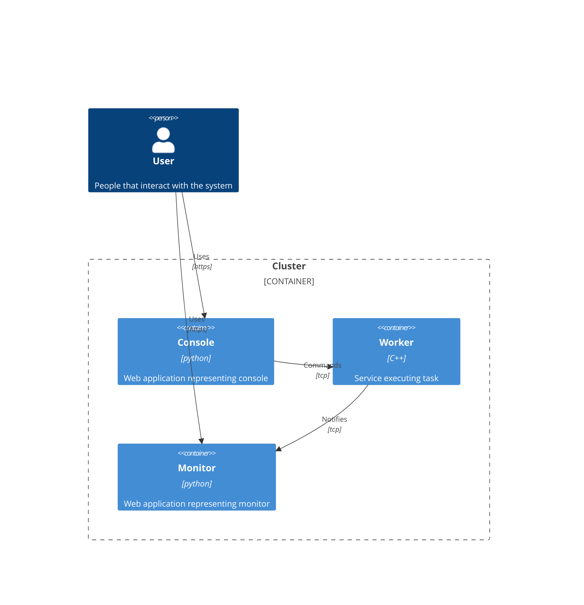

# Infra

Sample container infrastructure.

## Getting started

Once you've cloned the repository, please run the following command.
```shell
git submodule update --init --recursive
```

To launch the applications stack run the following shell script.
```shell
docker compose up; docker compose down
```

## Diagram



## Links

[Docker Desktop](https://www.docker.com/products/docker-desktop/)

[Rancher Desktop](https://rancherdesktop.io/)

[Lazydocker](https://github.com/jesseduffield/lazydocker)

[Docker Compose](https://docs.docker.com/compose/)
